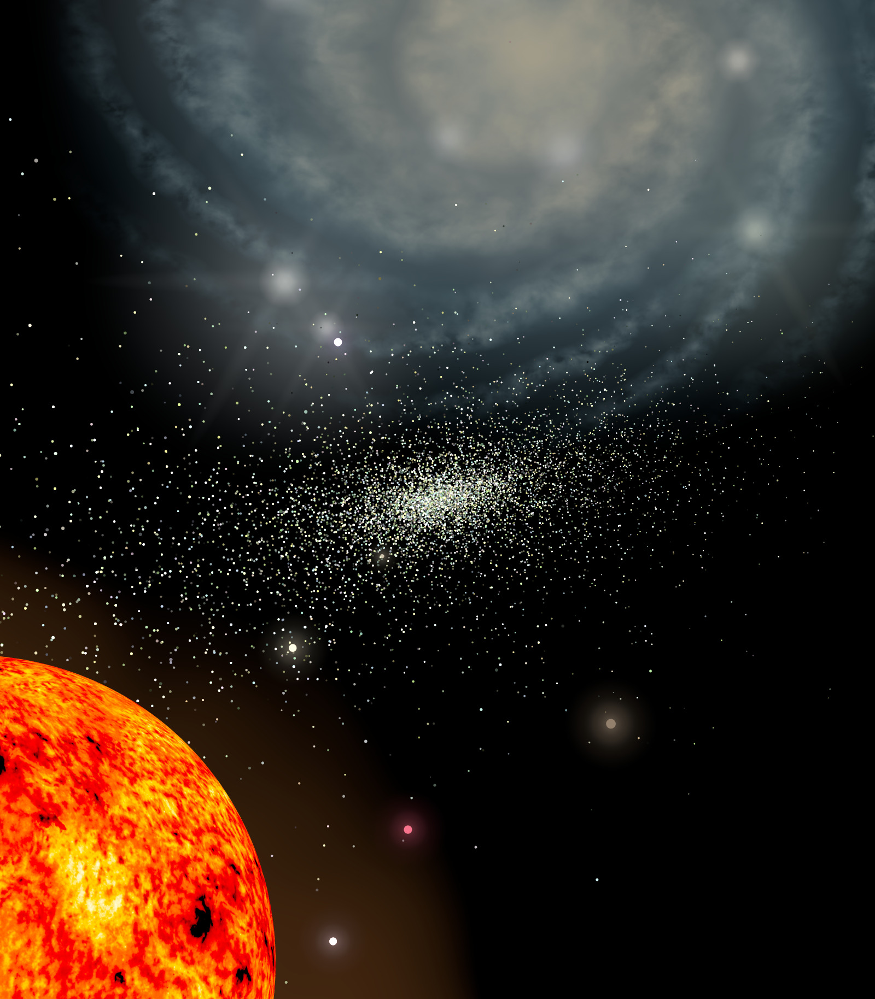
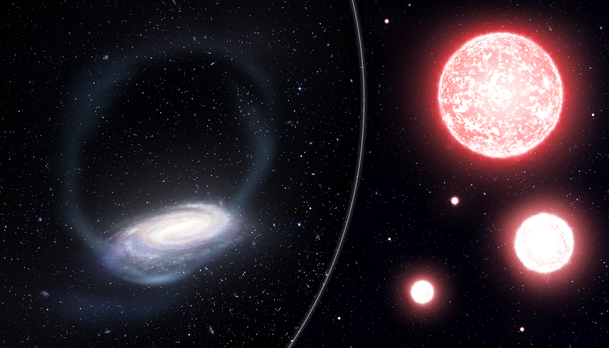
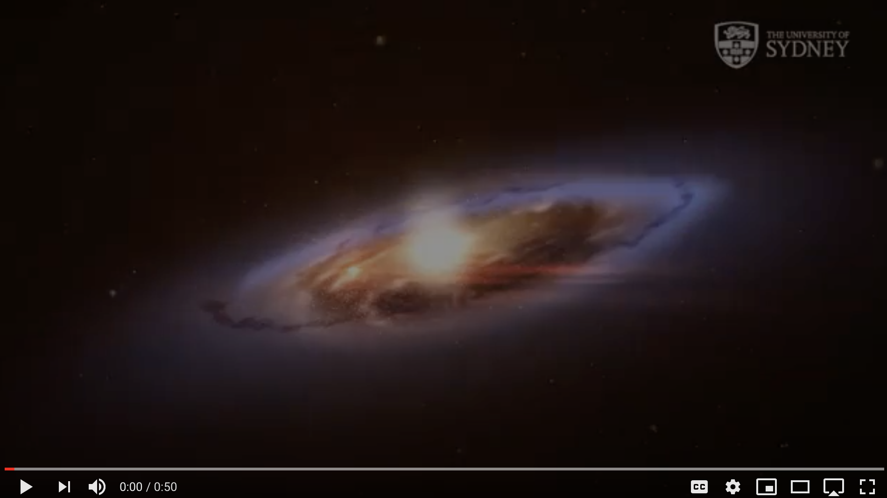

# The materials for the press-release on the Phoenix Stream.

The article "The tidal remnant of an unusually metal-poor globular cluster" by Zhen Wan and S5​ collaborators was published in Nature and is available [here](https://www.nature.com/articles/s41586-020-2483-6). 

## Links:

- [The S5​ collaboration](https://s5collab.github.io)

- [The Anglo-Australian Telescope](https://aat.anu.edu.au/about-us/AAT)

- [The Homepage of Geraint F. Lewis](https://www.geraintflewis.com)

- [The Homepage of Ting Li](https://sazabi4.github.io)

## Images:

The high resolution images and videos can be downloaded [here](./Images_Videos/)

Caption: An artist's representation of the Phoenix Stellar Stream. Originally a ball of stars, known as a globular cluster, Phoenix has been stretched into a stream of stars by the gravitational pull of the Milky Way. In a few billion years, Phoenix will be completely destroyed and absorbed into our Galaxy (*Credit: Geraint F. 
and the S5 collaboration*).

---

Caption: Artist’s impression of the thin stream of stars torn from the Phoenix globular cluster, wrapping around our Milky Way (left). For the study, the astronomers targeted bright Red Giant stars, to measure the chemical composition of the disrupted Phoenix globular cluster (Artist’s impression on right).

*Credit: James Josephides (Swinburne Astronomy Productions) and the S5 Collaboration*

----

## Videos

